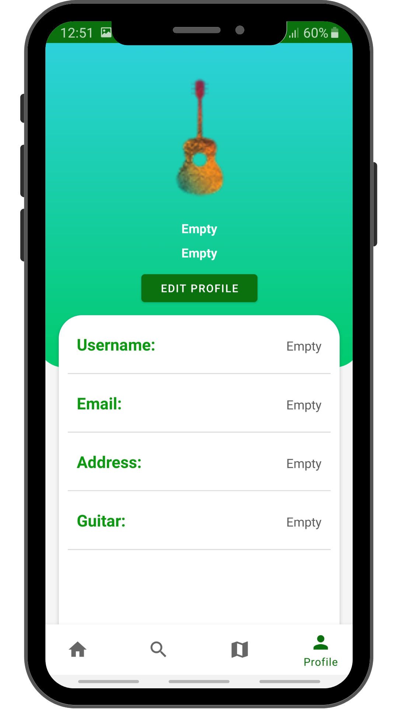
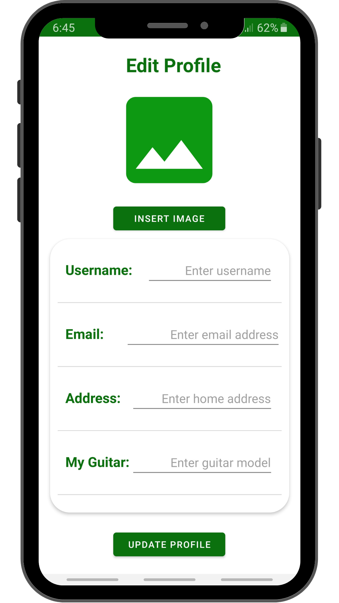
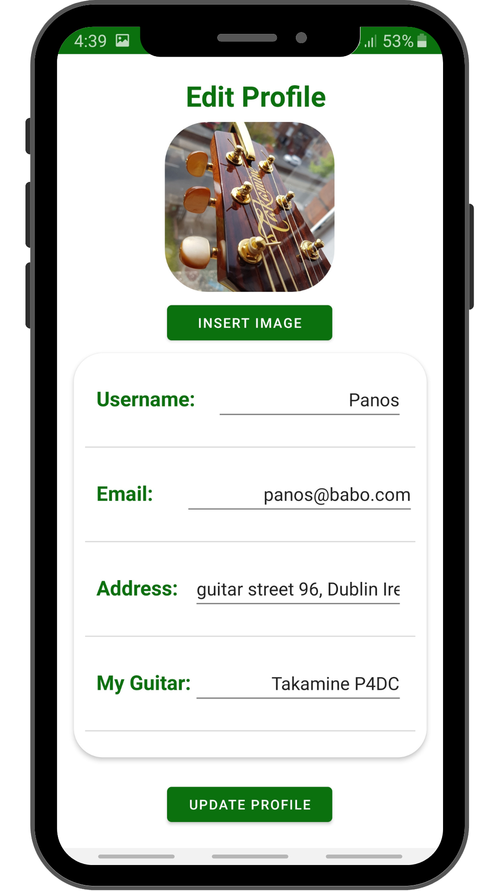
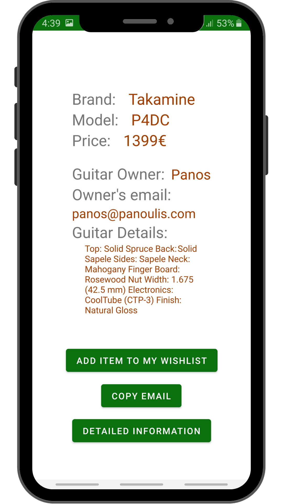
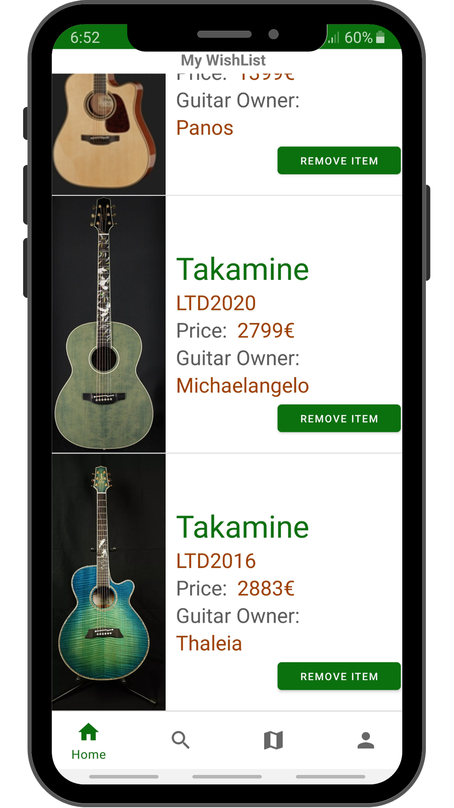
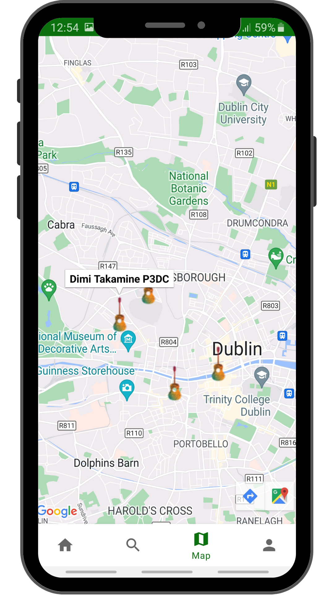

# TakOwnersMart

Author: Panosbabo  

## Description of the project
"TakOwnersMart" is a project that aims to a specific Acoustic Guitar owners of a brand named "Takamine", where the user is able to find other users selling their guitar within a certain range.

## Technology Selection

### Front-end
|     Technology     |        Description        |                Official website                |
| :----------------: | :----------------------:  | :--------------------------------------------: |
|        Java        | Java Programming Language |               https://www.java.com/en/         |

### Back-end
|     Technology     |        Description        |                Official website                |
| :----------------: | :----------------------:  | :--------------------------------------------: |
|        Java        | Java Programming Language |               https://www.java.com/en/         |
|        ROOM        |    Room Android Database  | https://developer.android.com/jetpack/androidx/releases/room |

# Screenshots
 
Search for Takamine guitar owners nearby
  

  </img>

 
Setup your details before looking into your wishlist
  

  </img>
  </img>
  </img>

 
Setup your Profile page and add your guitar
  

  </img>
  </img>
  </img>

 
Search for the owner of your favorite acoustic guitar and add it to your wishlist!
  

  </img>
  </img>
  </img>

 
Look where the owners are located on the map and meet up!
  

  </img>
  </img>

